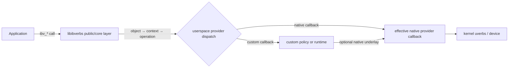

<!-- SPDX-License-Identifier: Apache-2.0 -->

# Customizing RDMA Verbs in OFED

## A provider-side design guide

[简体中文](README.zh-CN.md) · [Tutorial](docs/00-scope-and-terminology.md) ·
[Design checklist](docs/DESIGN_REVIEW_CHECKLIST.md) ·
[References](docs/REFERENCES.md)

This tutorial explains how a libibverbs call reaches a userspace provider and
how an existing OFED/rdma-core provider can install a context-scoped overlay of
custom operation callbacks. The public `mlx5` provider is used as a running
example; the design method also applies to providers with a comparable dispatch
model.

The central idea is small:

> Finish the provider's normal context initialization, then install a sparse
> operation-table overlay for a deliberately closed set of object families.

Making that idea safe is the real subject of the guide. A useful customization
must preserve object ownership, callback closure, error conventions,
concurrency, native fallback, ABI compatibility, and rollback.

The guide distinguishes three designs: a custom callback that wraps and
delegates on entirely native objects; a strict context whose intercepted object
families use custom representations; and an advanced registry-backed context in
which native and custom objects coexist. Their safety arguments are different
and must not be mixed.

## Scope and provenance

This is an independently written educational guide, not a provider fork,
installable patch set, or reproducibility artifact. It contains no source code,
source-derived patches, private ABI layouts, logs, traces, benchmark results, or
binaries from any private research or production implementation. The C-like
fragments are non-compilable pseudocode authored for this tutorial.

rdma-core source references are pinned to an immutable commit; other public
documentation is recorded with a last-verified date. The primary reference
snapshot is [`linux-rdma/rdma-core` v64.0](https://github.com/linux-rdma/rdma-core/tree/f272237493ef309984036f7b85655e11104c61c8).
Vendor OFED trees may add, remove, or move code; always repeat the source
navigation and ABI checks against the exact package you plan to modify.

## The 30-second mental model



At the public API boundary, some fast-path verbs are inline calls through an
object's context operation table. For example, upstream `ibv_post_send()` and
`ibv_post_recv()` dispatch through `qp->context->ops`. Inside libibverbs, the
provider-facing `verbs_context_ops` table is initialized with safe dummy
operations and populated by `verbs_set_ops()`. Providers may call
`verbs_set_ops()` more than once; non-null fields overlay the callbacks already
installed for that context.

The upstream `mlx5` provider demonstrates both pieces: it defines a common
operation table and applies an additional CQ-format-specific overlay during
context initialization. A custom provider build can use the same composition
point for a final, opt-in overlay.

## Why this is not an `LD_PRELOAD` tutorial

Dynamic-symbol interposition is not a complete way to intercept verbs. Common
data-path APIs such as `ibv_post_send()` are header-inline dispatches and may
never cross a dynamically interposable symbol. This guide therefore works
inside the userspace provider and changes the callback table attached to a
specific context.

Provider loading itself still uses dynamic loading. That is a separate concern:
libibverbs loads a provider shared object; the provider then supplies the
callbacks used by verbs objects created from its context.

## What you will learn

- distinguish the public verbs API, libibverbs core, userspace provider,
  kernel uAPI, and NIC;
- locate provider registration, context construction, base ops, and variant
  overlays in a pinned source tree;
- design a sparse custom ops overlay without mutating shared tables at runtime;
- save or identify the native underlay without recursively calling the public
  verb from its own wrapper;
- keep QP, CQ, SRQ, MR, and related operations closed over known object types;
- choose among native-object wrapping, strict custom-object families, and
  registry-backed mixed mode;
- reject unsupported extended operations explicitly;
- build and exercise an in-place provider without overwriting the system stack;
- verify provider selection, behavior with customization disabled, concurrency,
  failure, ABI compatibility, and rollback.

## What this guide does not do

- It does not define a new kernel verb, ioctl, firmware command, or wire
  protocol.
- It does not provide a production provider or a drop-in compatibility claim.
- It does not claim that `mlx5` provider internals are a stable public ABI.
- It does not teach system-wide replacement of `libibverbs` or `libmlx5`.
- It does not promise support for all verbs, QP types, CQ modes, or hardware.
- It does not publish a custom runtime, transport, scheduler, or performance
  result.

If your design needs a new kernel uAPI, prepare coordinated kernel and
rdma-core changes instead. If it only needs a new application-visible,
provider-specific feature, first consider a documented DV-style API. Callback
interposition is most appropriate when you intentionally own and test a custom
provider build.

## Learning path

1. [Scope and terminology](docs/00-scope-and-terminology.md)
2. [Trace the dispatch path](docs/01-trace-the-dispatch-path.md)
3. [Design a context-scoped ops overlay](docs/02-design-an-ops-overlay.md)
4. [Close object families and lifecycles](docs/03-close-object-lifecycles.md)
5. [Build, load, and roll back safely](docs/04-build-load-and-rollback.md)
6. [Validate behavior and compatibility](docs/05-validation-matrix.md)
7. [Handle versions and vendor forks](docs/06-versioning-and-portability.md)
8. [Respect licensing and provenance](docs/07-licensing-and-provenance.md)
9. [Run the final design review](docs/DESIGN_REVIEW_CHECKLIST.md)

Reusable worksheets:

- [Operation-closure matrix](docs/OPERATION_CLOSURE_TEMPLATE.md)
- [Version record](docs/VERSION_RECORD_TEMPLATE.md)

## The most important invariant

Once a context installs custom callbacks, every public object that can reach
those callbacks must have a known kind and owner.

Never derive a custom wrapper from an unknown public handle and then read a
trailing tag to decide whether the derivation was valid. The read is already
out of bounds when the object was created by the native path. Either enforce a
strict object-family closure at creation time, or consult a thread-safe registry
*before* performing a downcast.

## A compact design sequence

```text
PSEUDOCODE — NOT COMPILABLE

finish_provider_context(context):
    install(context, provider_base_ops)
    install(context, hardware_variant_ops)

    state = allocate_context_local_custom_state()
    state.mode = read_and_validate_configuration_once()
    state.native = identify_effective_native_callbacks()

    if state.mode is CUSTOM:
        verify_operation_family_closure()
        install(context, custom_overlay_ops)
```

The ordering is intentional. A later non-null callback replaces an earlier
one. If a hardware-specific overlay changes an operation such as CQ polling,
decide explicitly whether the custom wrapper goes before it, after it, or does
not support that variant. Do not let source order make the decision accidentally.

## Safe lab rule

Use a disposable development host, VM, container with appropriate device
access, or dedicated lab node. Build in place and run the tools from that build.
Do not overwrite a provider under `/usr`. Before enabling custom dispatch,
record which libibverbs and provider shared objects the process actually loads,
and preserve an independent path to stop the process or restore the native
environment.

## License

The original contents of this repository are licensed under the
[Apache License 2.0](LICENSE). External projects referenced by the guide are not
included and remain under their own licenses. See
[THIRD_PARTY_NOTICES.md](THIRD_PARTY_NOTICES.md),
[PROVENANCE.md](PROVENANCE.md), and [TRADEMARKS.md](TRADEMARKS.md).
