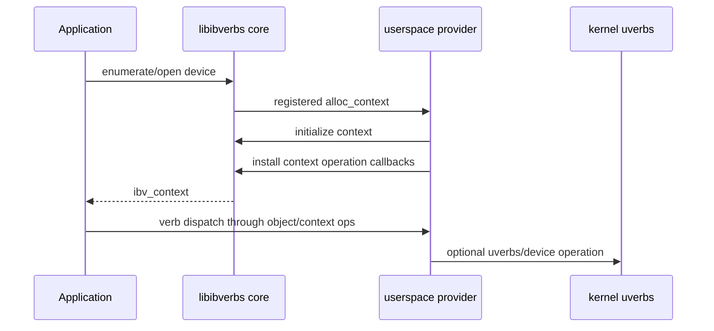

<!-- SPDX-License-Identifier: Apache-2.0 -->

# 1. Trace the dispatch path

[简体中文](zh-CN/01-trace-the-dispatch-path.md)

The safe place to customize a verb becomes clear only after following the call
from the application to the provider. This chapter uses public rdma-core v64.0
as a line-stable example.

## 1.1 Provider loading and operation dispatch are different

libibverbs discovers RDMA devices, loads candidate provider shared objects, and
asks a matching provider to allocate a context. The provider registers a
`verbs_device_ops` descriptor that includes device matching and context
allocation callbacks.

That loading path answers:

> Which provider owns this device and context?

After the context exists, verbs objects dispatch through operation callbacks
installed for that context. That path answers:

> Which implementation handles this operation on this object?

Do not conflate the two. A provider can be dynamically loaded without using
dynamic-symbol interposition for application verbs.



In the v64.0 source map:

- `PROVIDER_DRIVER(...)` in `libibverbs/driver.h` explains provider
  registration;
- `verbs_device_ops` includes `alloc_context` and `import_context`;
- the mlx5 provider binds those entries in `mlx5_dev_ops`;
- libibverbs' dynamic loader reads provider configuration and loads the shared
  object.

Follow the immutable links in [REFERENCES.md](REFERENCES.md) rather than relying
on line numbers from a different OFED package.

## 1.2 The public fast path can be inline

In public rdma-core v64.0, `ibv_post_send()` is a static inline function that
calls the `post_send` callback in `qp->context->ops`. `ibv_post_recv()` follows
the same pattern. The compiler can place that dispatch directly in the
application.

The important consequence is not that every verb is inline; they are not. The
consequence is that intercepting only exported `ibv_*` symbols is not a complete
coverage strategy. A call may never reach a symbol that `LD_PRELOAD` can replace.

That is why this tutorial operates at the provider's context callback table.

## 1.3 Two operation-table views

rdma-core exposes a public `ibv_context_ops` shape used by legacy/public inline
paths and maintains a broader provider-facing `verbs_context_ops` internally.
The latter contains classic and extended operations for QP, CQ, SRQ, MR, flow,
device memory, counters, and other object families.

During context initialization, libibverbs first installs dummy operations. The
dummy callbacks normally return `EOPNOTSUPP` or do nothing. A provider then calls
`verbs_set_ops()` with its supported callbacks.

The provider-facing header is an internal build header, not an installed
application extension API. Its structures and symbols are tied to the provider
private ABI. Conversely, the public `ibv_context_ops` layout being visible in a
public header does not make direct application modification of it supported.

Upstream documents a crucial composition rule in `verbs_set_ops()`:

- a non-null field replaces the currently installed callback;
- a null field leaves the current callback unchanged;
- providers may call the function multiple times for hardware variations.

This makes a sparse overlay a natural customization mechanism. There is no need
to modify the callback table after the context becomes visible to the
application.

Use `verbs_set_ops()` rather than assigning selected fields in
`ibv_context.ops` directly. The helper updates the broader private table,
public fast-path slots, and compatibility slots consistently. A direct write can
appear to intercept post/poll while missing create, destroy, query, or another
private dispatch path.

## 1.4 The mlx5 running example

At the pinned v64.0 revision, mlx5:

1. defines a large common ops table;
2. initializes the provider context and hardware state;
3. installs the common ops with `verbs_set_ops()`;
4. conditionally installs a small CQE-version overlay;
5. completes capability discovery and returns the context;
6. registers the provider through `PROVIDER_DRIVER(mlx5, ...)`.

The example teaches two general rules.

First, the **effective native callback** may not be the entry in the common
table. A hardware overlay can replace it later. A custom wrapper that needs to
delegate must preserve the effective callback for the selected variant.

Second, **overlay order is policy**. If the custom overlay is installed last, it
wins for every non-null field it supplies. If a later hardware overlay replaces
the same field, the custom callback silently stops receiving that operation.
Make the intended order explicit and test each hardware variant.

Classic context callbacks are still not the whole surface. Extended QPs contain
WR-builder callbacks, and extended CQs contain polling callbacks in their own
objects. Those paths can bypass classic `post_send` or `poll_cq` overlays. A
support matrix must classify them separately.

## 1.5 A source-navigation recipe

For any provider or OFED fork, answer these questions before editing:

1. Where is the provider registered?
2. Which function allocates and imports a context?
3. Where is the base `verbs_context_ops` table defined?
4. How many later calls to `verbs_set_ops()` exist?
5. Which callbacks vary by hardware capability, kernel ABI, or CQE format?
6. Which public APIs dispatch through `ibv_context.ops` inline?
7. Which operations live only in the extended provider table?
8. Which CMake target and provider suffix belong to this private ABI version?

Useful read-only searches in a checked-out source tree include:

```sh
rg -n "struct verbs_context_ops|verbs_set_ops\(" libibverbs providers
rg -n "PROVIDER_DRIVER\(|alloc_context|import_context" providers
rg -n "static inline int ibv_post_|static inline int ibv_poll" libibverbs
rg -n "rdma_shared_provider\(|rdma_provider\(" providers buildlib
```

These commands locate public upstream code; they do not modify or load a
provider.

## 1.6 Private ABI warning

`verbs_context_ops` is a provider-private structure. rdma-core ties provider
plugins to an `IBVERBS_PABI_VERSION`, and the generated provider filename embeds
that version. This is an intentional guard against mixing a provider built for
one private ABI with a different libibverbs.

The practical rule is strict:

> Build and run libibverbs and the customized provider from the same pinned
> source tree. Do not compile against one tree and load into another.

The version discipline is developed in
[Handle versions and vendor forks](06-versioning-and-portability.md).

Next: [Design a context-scoped ops overlay](02-design-an-ops-overlay.md).
