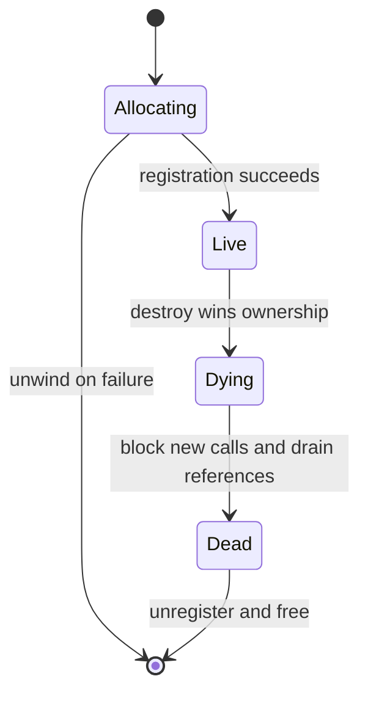

<!-- SPDX-License-Identifier: Apache-2.0 -->

# 3. Close object families and lifecycles

[简体中文](zh-CN/03-close-object-lifecycles.md)

Replacing one callback is easy. Proving that every object reaching that callback
has the expected concrete representation is the central safety problem.

## 3.1 Think in object families, not individual verbs

An operation table is a graph of constructors, consumers, relationships, event
paths, and destructors. If a custom constructor returns a façade rather than a
normal hardware-backed provider object, every later operation on that handle
must understand the façade.

Start with a closure matrix.

| Family | Constructors to classify | Consumers to classify | Teardown/event paths |
|---|---|---|---|
| QP | classic create, extended create, `open_qp`, provider-specific create; creation/use on an imported context | query, modify, send/receive, rate/ECE/counter helpers | destroy, async events |
| CQ | classic create, extended create | poll, notify, resize/modify | destroy, CQ events/channel handling |
| SRQ | classic/extended create; creation/use on an imported context | post, query, modify | destroy, events |
| MR | register, extended/dmabuf/device-memory register, import | use by WRs, advise/reregister | deregister, unimport |
| PD and context | allocate/import/open | ownership checks for related objects | deallocate/close |

Extended objects may also carry operation callbacks in the object itself. An
`ibv_qp_ex` WR-builder path is not automatically covered by replacing classic
`post_send`, and an `ibv_cq_ex` polling path is not automatically covered by
replacing classic `poll_cq`. Classify both the context table and object-local
method surfaces.

The exact operations change across versions. Generate the matrix from the
pinned `verbs_context_ops` definition. Record two independent dimensions:

- **Object representation:** `NATIVE`, `CUSTOM`, or `NONE` for an operation that
  creates no object.
- **Callback policy:** `NATIVE`, `WRAP_NATIVE`, `CUSTOM`, `ADAPTED`, `REJECTED`,
  or `NOT REACHABLE`.

`WRAP_NATIVE` means a custom callback receives a proven native provider object
and delegates to the effective native callback. `CUSTOM` means the callback
understands a custom object representation. `ADAPTED` is complete and lossless;
`REJECTED` returns the correct error; `NOT REACHABLE` is enforced by an earlier
checked invariant.

Blank cells are bugs, not future documentation work.

## 3.2 The unsafe “downcast, then check” pattern

Suppose a custom object embeds a native provider object and adds a tag after it.
It is tempting to derive the custom wrapper with `container_of()` and then read
the tag.

That check is valid only when the input was already proven to point inside the
custom allocation. If an unoverridden extended constructor returned a normal
native object, deriving a larger wrapper and reading the trailing tag accesses
memory outside the allocation. The type check itself has undefined behavior.

Therefore:

> Classification must happen before a downcast, unless construction-time rules
> already prove that every object in the context belongs to the custom family.

A magic value after a native base object does not solve this problem.

## 3.3 Three valid representation models

### Native-object wrapper

All objects retain the provider's native representation. A sparse custom
callback observes or validates an operation and delegates to the effective
native callback. Constructors and destructors remain native unless a guard is
needed to exclude a mode that would bypass the wrapper. Chapter 2's worked
example uses this model.

This is the smallest and safest first experiment, but its claim is also narrow:
it does not virtualize objects and it may not cover extended object-local APIs.

### Strict custom-object family

Every object in an intercepted family has the custom representation, and every
reachable operation understands or rejects that representation. This is the
recommended baseline when constructors return façade or virtual objects.

### Registry-backed mixed family

Native and custom representations coexist. A registry classifies a still-valid
public handle before downcast. This is the most complex model and should follow,
not precede, a correct strict design.

Choose one model per object family and state it in the support matrix. A context
may wrap native QPs while using a strict custom CQ family, but every cross-object
combination still needs an explicit rule.

## 3.4 Strict custom-context mode

Strict mode is the best starting point for a tutorial and often for a real
prototype.

```text
CUSTOM CONTEXT
    ⇒ every QP that reaches custom QP callbacks is a CUSTOM QP
    ⇒ every CQ that reaches custom CQ callbacks is a CUSTOM CQ
```

Enforce the invariant at creation time:

- intercept classic and extended creators for each custom family;
- adapt an extended request only when the conversion is complete and lossless;
- reject other extended requests before a native handle is created;
- reject event channels, SRQs, or provider-specific features that the custom
  family cannot honor;
- verify that related PD, CQ, SRQ, and QP objects belong to compatible contexts
  and families;
- keep internal native work on a separate native context.

```text
PSEUDOCODE — NOT COMPILABLE

custom_create_endpoint_extended(context, attributes):
    if attributes are exactly reducible to the supported classic subset:
        return custom_create_endpoint(attributes.as_classic)

    fail_with_operation_not_supported()
```

Failing at creation is safer than returning an object that will fail
unpredictably at send, poll, notification, or destruction time.

## 3.5 Advanced option: registry-backed mixed mode

Some designs need native and custom objects in one context. Use a provider-owned,
thread-safe registry keyed by the public handle. The lookup happens before any
downcast.

```text
PSEUDOCODE — NOT COMPILABLE

route_operation(public_handle):
    entry = registry.acquire(public_handle)

    if entry is CUSTOM and entry.owner is public_handle.context:
        custom_object = downcast_proven_custom_handle(public_handle)
        result = run_custom_operation(custom_object)
    else if entry is NATIVE and entry.owner is public_handle.context:
        result = entry.saved_native_callback(public_handle)
    else:
        result = fail_closed_for_unknown_or_foreign_live_base_handle()

    registry.release(entry)
    return result
```

A useful registry entry includes:

- public pointer and object family;
- native/custom kind;
- owning context;
- `LIVE`, `DYING`, or `DEAD` state;
- generation number;
- in-flight reference count;
- the native callback or dispatch policy required for safe delegation.

Every reachable creator must register the result before returning its public
handle. This includes classic and extended creators, `open_qp`,
provider-specific/direct-verbs creators in scope, and object creation on an
imported context.

```text
PSEUDOCODE — NOT COMPILABLE

mixed_create(context, attributes):
    object, kind = create_according_to_validated_policy(attributes)
    if object creation failed:
        return failure

    if registry.insert_before_publish(object.public_handle,
                                      kind, context) failed:
        destroy_with_the_matching_underlay(object, kind)
        return failure

    return object.public_handle
```

Registration failure must unwind through the matching native or custom
destructor. A mixed design that registers only custom objects cannot safely
promise native passthrough: a valid native object from a missed creator will be
unclassified and must fail closed.

A provider-specific/direct-verbs API may allocate an object through an entry
point that never consults `verbs_set_ops()`. Each in-scope public entry point
must therefore register or reject its object explicitly; context-table coverage
alone is not proof of creator coverage.

Unknown objects must not default to native. They may be foreign or the result of
a missed constructor.

A registry does **not** make an arbitrary freed public pointer safe. Many public
verbs read `handle->context` before entering a provider callback, so a raw
use-after-free can fail before registry lookup. Generation numbers are useful
for custom asynchronous commands, completions, and tokens that carry the
generation; they do not distinguish an old C pointer after its address has been
reused. Stronger tolerance requires keeping a tombstone allocation reachable or
delaying reclamation, with an explicit API contract and cost.

Mixed mode costs lookup and synchronization on hot paths. Use it only after the
strict design is correct and a measured requirement justifies the complexity.

## 3.6 Make create and destroy symmetric

A custom object's lifecycle should be a state machine, not a collection of free
calls.



Important rules:

- register an object only after every required field and relationship is valid;
- on partial create failure, undo resources in reverse order;
- make exactly one destroy caller own the `LIVE → DYING` transition;
- prevent new registry acquisitions after `DYING`;
- wait for or cancel in-flight callbacks according to the documented contract;
- remove the registry entry only when no callback can still use it;
- put generations in custom asynchronous commands/completions so a recycled
  logical identity cannot accept an old completion;
- define context-close behavior when child objects remain live.

Test failed-create and context-close paths. For destroy-versus-post/poll, either
state the application synchronization precondition inherited from the public
API or implement delayed reclamation/reference ownership before claiming the
race is tolerated. Double destroy and raw use-after-destroy are invalid unless a
separate tombstone contract explicitly supports them.

## 3.7 Preserve public semantic contracts

Type safety is necessary but insufficient. A wrapper must preserve the public
operation's observable contract or document a deliberate semantic difference.

### Work-request lists and `bad_wr`

If an API accepts a linked list, define what happens when the first *n* entries
succeed and the next fails. Return the same form of status and set `bad_wr` to
the correct original request. Do not return success merely because a prefix was
accepted unless that is the documented contract.

### Opaque identifiers

Treat a user-provided `wr_id` as an opaque value of its full width. Store routing
metadata separately. Packing metadata into high bits silently changes the API
unless the application explicitly opted into that representation.

### Completion semantics

Preserve or document:

- status and opcode;
- byte length and immediate data;
- source and destination identity fields;
- signaled versus unsignaled behavior;
- per-QP ordering;
- error completion and flush behavior;
- polling return count and partial batches.

### Receive semantics

If a custom runtime buffers data before the application posts a receive, it may
no longer match native RC backpressure or RNR behavior. If a destination buffer
is too small, silent truncation followed by a successful WC is not equivalent to
native behavior. State and test the chosen semantics.

### CQ events

A software-backed or façade CQ cannot safely inherit native arm, resize,
notification, event, or destroy callbacks unless it is a valid native CQ for
those operations. Either implement the complete CQ family or reject the
unsupported mode at creation.

## 3.8 Cross-object validation

When creating or modifying a QP, validate all related handles before storing
them:

- PD and context ownership match;
- send and receive CQs are supported kinds;
- an SRQ is absent or belongs to a supported family;
- capabilities and limits are internally consistent;
- extended masks contain no ignored fields;
- imported/opened objects follow an explicit policy.

The same principle applies to MRs used in commands: validate ownership, address
range, length, access, and lifetime. Never treat a process pointer, lkey, rkey,
or provider object address as a portable cross-process handle.

## 3.9 Concurrency checklist

- [ ] Provider state is per context/device rather than an accidental process
  singleton.
- [ ] Callback tables are immutable after publication.
- [ ] Registry lookups hold a lifetime reference before returning an entry.
- [ ] Destroy and post/poll follow a documented application synchronization or
  delayed-reclamation rule.
- [ ] Control requests have framing and request IDs if multiple threads share a
  channel.
- [ ] Queue capacity is bounded; full queues return or back off according to a
  documented policy rather than spin forever.
- [ ] Fork behavior is documented and tested or explicitly unsupported.
- [ ] Diagnostics never expose payloads, pointers, memory keys, or secrets.

## 3.10 Context shutdown

Custom state has the same lifetime boundary as the context that owns the ops
overlay. The normal close path must:

1. transition the custom context state to `CLOSING`;
2. reject new custom object creation and backend submission;
3. apply the documented caller-synchronization or drain rule;
4. close custom backend channels and registries;
5. verify that no live child object remains, or destroy only those the contract
   permits the context to own;
6. destroy custom locks/atomics/resources;
7. invoke the provider's complete native context cleanup last.

This can be implemented by extending the provider's native cleanup function or
by overlaying `free_context` and calling a saved native free callback. Calling a
lower-level deallocation helper can skip provider bookkeeping. Calling the
public close function from the wrapper recurses.

Next: [Build, load, and roll back safely](04-build-load-and-rollback.md).
