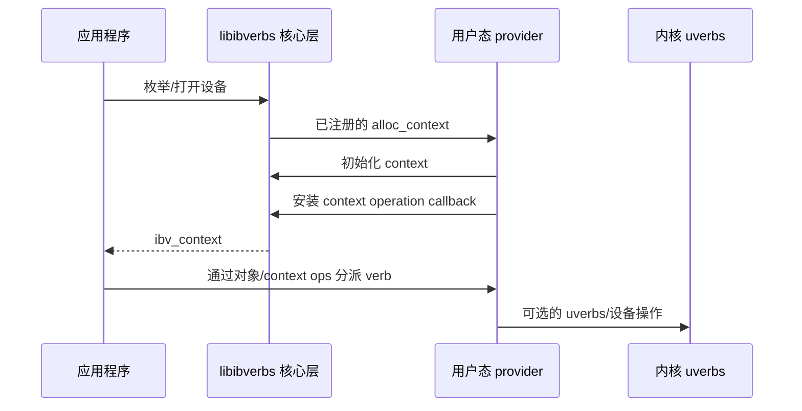

<!-- SPDX-License-Identifier: Apache-2.0 -->

# 1. 追踪分派（dispatch）路径

[English](../01-trace-the-dispatch-path.md)

只有沿着一次调用从应用程序追踪到用户态 provider（userspace provider），才能看清
定制 verb 的安全位置。本章以
公开的 rdma-core v64.0 为行号稳定的示例。

## 1.1 Provider 加载与操作分派是两件不同的事

libibverbs 发现 RDMA 设备、加载候选 provider 共享对象，并请求匹配的 provider 分配
context。Provider 会注册一个 `verbs_device_ops` 描述符，其中包含设备匹配与 context
分配回调（callback）。

加载路径回答的是：

> 哪个 provider 拥有这个设备和 context？

context 建立后，verbs 对象通过为该 context 安装的 operation callback 进行分派。这条
路径回答的是：

> 哪个实现负责处理这个对象上的这项操作？

不要混淆这两个问题。Provider 可以通过动态方式加载，而无需对应用程序 verbs 使用
动态符号插桩（dynamic-symbol interposition）。



在 v64.0 的源码映射中：

- `libibverbs/driver.h` 中的 `PROVIDER_DRIVER(...)` 说明了 provider 注册；
- `verbs_device_ops` 包含 `alloc_context` 和 `import_context`；
- mlx5 provider 在 `mlx5_dev_ops` 中绑定这些入口；
- libibverbs 的动态加载器读取 provider 配置并加载共享对象。

应跟随 [REFERENCES.md](../REFERENCES.md) 中的不可变链接，而不是依赖其他 OFED 软件包
中的行号。

## 1.2 公共快路径可能是 inline 的

在公开的 rdma-core v64.0 中，`ibv_post_send()` 是一个 static inline 函数，它调用
`qp->context->ops` 中的 `post_send` callback。`ibv_post_recv()` 也采用相同模式。编译器
可以把这次分派直接放进应用程序。

这里的重要结论并不是“每一个 verb 都是 inline 的”——事实并非如此。真正的结论是：
只拦截导出的 `ibv_*` 符号并不能形成完整覆盖。某次调用可能根本不会到达可由
`LD_PRELOAD` 替换的符号。

因此，本教程选择在 provider 的 context callback table 上操作。

## 1.3 两种 operation-table 视图

rdma-core 暴露了公共的 `ibv_context_ops` 结构，供 legacy/公共 inline 路径使用；同时，
它在内部维护范围更广、面向 provider 的 `verbs_context_ops`。后者包含 QP、CQ、SRQ、
MR、flow、设备内存、counter 以及其他对象族的 classic 和 extended 操作。

在 context 初始化期间，libibverbs 首先安装 dummy operation。Dummy callback 通常返回
`EOPNOTSUPP` 或不执行任何操作。随后，provider 使用其支持的 callback 调用
`verbs_set_ops()`。

面向 provider 的头文件是内部构建头文件，而不是已安装的应用扩展 API。其结构和符号
与 provider 私有 ABI 绑定。反过来，即使公共头文件中可以看到 `ibv_context_ops` 的
布局，也不代表应用程序可以受支持地直接修改它。

上游为 `verbs_set_ops()` 规定了一条关键的组合规则：

- 非空字段替换当前已经安装的 callback；
- 空字段保留当前 callback，不作修改；
- provider 可以为不同硬件变体多次调用该函数。

这使稀疏 overlay 成为一种自然的定制机制。context 对应用可见之后，无需再修改 callback
table。

应使用 `verbs_set_ops()`，不要直接为 `ibv_context.ops` 的选定字段赋值。该辅助函数会
一致地更新范围更广的私有表、公共快路径 slot 和兼容性 slot。直接写字段可能看起来已经
拦截了 post/poll，却漏掉 create、destroy、query 或另一条私有分派路径。

## 1.4 mlx5 贯穿示例

在固定的 v64.0 revision 中，mlx5 会：

1. 定义一张规模较大的公共 ops 表；
2. 初始化 provider context 和硬件状态；
3. 使用 `verbs_set_ops()` 安装公共 ops；
4. 按条件安装一个小型 CQE 版本 overlay；
5. 完成能力发现并返回 context；
6. 通过 `PROVIDER_DRIVER(mlx5, ...)` 注册 provider。

这个示例说明了两条通用规则。

第一，**有效原生 callback（effective native callback）**未必就是公共表中的入口。硬件
overlay 可能稍后替换它。需要委托原生行为的自定义 wrapper，必须为所选变体保留有效
callback。

第二，**overlay 顺序就是策略（overlay order is policy）**。如果最后安装 custom
overlay，它提供的每个非空字段都会生效。如果某个更晚的硬件 overlay 再次替换同一
字段，自定义 callback 就会悄无声息地停止接收该操作。应明确规定预期顺序，并测试每种
硬件变体。

Classic context callback 仍然没有覆盖全部接口面。Extended QP 在对象自身携带 WR
builder callback，extended CQ 也在自身对象中携带 polling callback。这些路径可能绕过
classic `post_send` 或 `poll_cq` overlay。支持矩阵必须分别对它们进行分类。

## 1.5 源码定位步骤

对于任意 provider 或 OFED fork，在编辑之前回答以下问题：

1. provider 在哪里注册？
2. 哪个函数负责分配和导入 context？
3. 基础 `verbs_context_ops` 表定义在哪里？
4. 后续还调用了多少次 `verbs_set_ops()`？
5. 哪些 callback 会随硬件能力、内核 ABI 或 CQE 格式变化？
6. 哪些公共 API 通过 `ibv_context.ops` 进行 inline 分派？
7. 哪些操作只存在于 extended provider table 中？
8. 哪个 CMake target 和 provider suffix 对应当前私有 ABI 版本？

在已经 checkout 的源码树中，可以使用以下只读搜索命令：

```sh
rg -n "struct verbs_context_ops|verbs_set_ops\(" libibverbs providers
rg -n "PROVIDER_DRIVER\(|alloc_context|import_context" providers
rg -n "static inline int ibv_post_|static inline int ibv_poll" libibverbs
rg -n "rdma_shared_provider\(|rdma_provider\(" providers buildlib
```

这些命令只定位公开上游代码，不会修改或加载 provider。

## 1.6 私有 ABI 警告

`verbs_context_ops` 是 provider 私有结构。rdma-core 使用 `IBVERBS_PABI_VERSION` 绑定
provider 插件，生成的 provider 文件名也会嵌入该版本。这是一项有意设置的防护，用于
避免把针对某一私有 ABI 构建的 provider 与另一版 libibverbs 混用。

实际规则很严格：

> 必须从同一份固定源码树构建并运行 libibverbs 与自定义 provider。不要针对一棵源码树
> 编译，再把结果加载到另一棵源码树构建的运行时中。

[版本和 vendor fork](06-versioning-and-portability.md) 一章将进一步说明版本约束。

下一章：[设计上下文级（context-scoped）ops overlay](02-design-an-ops-overlay.md)。
