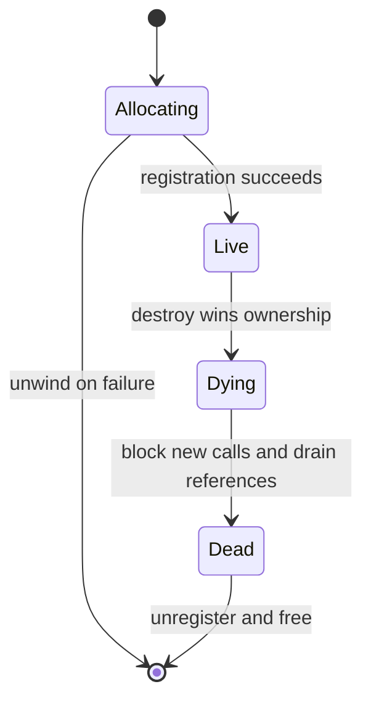

<!-- SPDX-License-Identifier: Apache-2.0 -->

# 3. 对象族闭包与生命周期

[English](../03-close-object-lifecycles.md)

替换一个 callback 很容易。证明每个到达该 callback 的对象都具有预期的具体表示，
才是核心安全问题。

## 3.1 按对象族思考，而不是按单个 verb 思考

一张 operation table 是由构造器、消费者、对象关系、事件路径和析构器组成的图。
如果自定义构造器返回的不是由硬件支撑的正常 provider 对象，而是一个外观对象，
那么后续所有作用于该 handle 的操作都必须理解这种外观表示。

先从闭包矩阵开始。

| 对象族 | 需要分类的构造路径 | 需要分类的使用路径 | 拆除/事件路径 |
|---|---|---|---|
| QP | classic create、extended create、`open_qp`、provider-specific create；在 imported context 上创建/使用 | query、modify、send/receive、rate/ECE/counter helper | destroy、async event |
| CQ | classic create、extended create | poll、notify、resize/modify | destroy、CQ event/channel 处理 |
| SRQ | classic/extended create；在 imported context 上创建/使用 | post、query、modify | destroy、event |
| MR | register、extended/dmabuf/device-memory register、import | 被 WR 使用、advise/reregister | deregister、unimport |
| PD 与 context | allocate/import/open | 关联对象的所有权检查 | deallocate/close |

extended 对象还可能在对象自身携带 operation callback。替换 classic `post_send`
不会自动覆盖 `ibv_qp_ex` 的 WR-builder 路径；替换 classic `poll_cq` 也不会自动覆盖
`ibv_cq_ex` 的 polling 路径。必须分别对 context table 和对象局部的方法表面进行分类。

具体 operation 会随版本变化。应从固定版本的 `verbs_context_ops` 定义生成矩阵，
并记录两个相互独立的维度：

- **对象表示：** 对于会创建对象的 operation，取值为 `NATIVE`、`CUSTOM`；对于不创建
  对象的 operation，取值为 `NONE`。
- **Callback 策略：** `NATIVE`、`WRAP_NATIVE`、`CUSTOM`、`ADAPTED`、`REJECTED`
  或 `NOT REACHABLE`。

`WRAP_NATIVE` 表示 custom callback 接收一个已经证实为原生 provider 对象的实例，
并委托给实际生效的 native callback。`CUSTOM` 表示 callback 理解自定义对象表示；
`ADAPTED` 表示转换完整且无损；`REJECTED` 表示返回正确的错误；
`NOT REACHABLE` 表示更早的、已经检查过的不变量保证该路径不可达。

空白单元格是 bug，不是留待以后补写的文档。

## 3.2 不安全的“先 downcast，再检查”模式

假设一个自定义对象嵌入了原生 provider 对象，并在它后面附加了一个 tag。很容易想到
先用 `container_of()` 推导出自定义 wrapper，再读取 tag。

只有在输入已经被证明指向自定义 allocation 内部时，这种检查才有效。如果某个未被
覆盖的 extended 构造器返回了正常原生对象，那么推导一个更大的 wrapper 并读取尾部
tag，就会访问 allocation 之外的内存。这个类型检查本身已经具有未定义行为。

因此：

> 必须先分类，再 downcast；除非构造期规则已经证明该 context 中的每一个对象都属于
> 自定义对象族。

在原生 base object 后面放置 magic value 并不能解决这个问题。

## 3.3 三种有效的表示模型

### 原生对象 wrapper

所有对象都保留 provider 的原生表示。稀疏的 custom callback 观察或验证某项操作，
然后委托给实际生效的 native callback。构造器和析构器保持原生，除非必须增加 guard，
用来排除会绕过 wrapper 的模式。第 2 章的完整示例使用的就是这个模型。

这是最小、最安全的首次实验，但它的适用声明也很窄：它不虚拟化对象，而且可能无法
覆盖 extended 的对象局部 API。

### 严格自定义对象族

被拦截对象族中的每一个对象都采用自定义表示，并且每一项可达操作都理解这种表示，
或者明确拒绝它。当构造器返回外观对象或虚拟对象时，这是推荐的基线模型。

### 注册表支撑的混合对象族

原生表示和自定义表示共存。注册表在 downcast 之前对仍然有效的 public handle
进行分类。这是最复杂的模型；应当先得到正确的严格设计，再考虑混合模型，而不是反过来。

为每个对象族选择一种模型，并在支持矩阵中明确记录。一个 context 可以对原生 QP
使用 wrapper，同时对 CQ 使用严格自定义对象族，但所有跨对象组合仍然必须有明确规则。

## 3.4 严格 custom-context 模式

严格模式是教程的最佳起点，通常也是真实原型的最佳起点。

```text
CUSTOM CONTEXT
    ⇒ every QP that reaches custom QP callbacks is a CUSTOM QP
    ⇒ every CQ that reaches custom CQ callbacks is a CUSTOM CQ
```

在创建阶段强制执行该不变量：

- 拦截每个自定义对象族的 classic 和 extended 构造器；
- 仅当转换完整且无损时，才适配 extended request；
- 在创建原生 handle 之前拒绝其他 extended request；
- 如果自定义对象族无法兑现 event channel、SRQ 或 provider-specific feature 的语义，
  就拒绝它们；
- 验证关联的 PD、CQ、SRQ 和 QP 对象属于相容的 context 和对象族；
- 在独立的 native context 上执行内部原生工作。

```text
PSEUDOCODE — NOT COMPILABLE

custom_create_endpoint_extended(context, attributes):
    if attributes are exactly reducible to the supported classic subset:
        return custom_create_endpoint(attributes.as_classic)

    fail_with_operation_not_supported()
```

在创建阶段失败，比返回一个随后在 send、poll、notification 或 destruction 时以不可预测
方式失败的对象更安全。

## 3.5 高级选项：注册表支撑的 mixed mode

有些设计需要在同一 context 中同时存在原生对象和自定义对象。应使用由 provider
持有、以 public handle 为键的线程安全注册表，并在任何 downcast 之前完成查询。

```text
PSEUDOCODE — NOT COMPILABLE

route_operation(public_handle):
    entry = registry.acquire(public_handle)

    if entry is CUSTOM and entry.owner is public_handle.context:
        custom_object = downcast_proven_custom_handle(public_handle)
        result = run_custom_operation(custom_object)
    else if entry is NATIVE and entry.owner is public_handle.context:
        result = entry.saved_native_callback(public_handle)
    else:
        result = fail_closed_for_unknown_or_foreign_live_base_handle()

    registry.release(entry)
    return result
```

一个有用的注册表条目包括：

- public pointer 和对象族；
- native/custom 类型；
- 所属 context；
- `LIVE`、`DYING` 或 `DEAD` 状态；
- generation number；
- in-flight reference count；
- 安全委托所需的 native callback 或 dispatch policy。

每一条可达的构造路径都必须在返回 public handle 之前登记其结果。这包括 classic 和
extended 构造器、`open_qp`、属于支持范围的 provider-specific/direct-verbs 构造器，
以及在 imported context 上创建对象的路径。

```text
PSEUDOCODE — NOT COMPILABLE

mixed_create(context, attributes):
    object, kind = create_according_to_validated_policy(attributes)
    if object creation failed:
        return failure

    if registry.insert_before_publish(object.public_handle,
                                      kind, context) failed:
        destroy_with_the_matching_underlay(object, kind)
        return failure

    return object.public_handle
```

登记失败时，必须通过与该对象类型匹配的原生或自定义析构器完成回退清理。一个只登记
自定义对象的 mixed design 不能安全地承诺 native passthrough：如果某个漏拦构造器
创建了有效的原生对象，它将无法被分类，因此必须 fail closed。

provider-specific/direct-verbs API 可能通过一个完全不查询 `verbs_set_ops()` 的入口
分配对象。因此，每个属于支持范围的 public entry point 都必须显式登记或拒绝其对象；
仅覆盖 context table 并不能证明构造路径已经完整覆盖。

未知对象不能默认按 native 处理。它们可能归属于其他 context，也可能是某个漏拦构造器的结果。

注册表**不能**使任意已经释放的 public pointer 变得安全。许多 public verb 会在进入
provider callback 之前读取 `handle->context`，因此原始的 use-after-free 可能在注册表
查询发生前就失败。generation number 对携带 generation 的自定义异步命令、completion
和 token 有用；但在旧 C pointer 的地址被复用后，它无法将旧 pointer 与新 pointer 区分。
更强的容错能力需要保留一个可达的 tombstone allocation，或者延迟 reclamation；同时还要
明确相应的 API 契约和成本。

mixed mode 会在热路径上付出查询和同步成本。只有在严格设计已经正确，并且有经过测量的
需求证明这份复杂性合理之后，才应使用 mixed mode。

## 3.6 让 create 与 destroy 对称

自定义对象的生命周期应当是一台状态机，而不是一组彼此孤立的 free 调用。



重要规则包括：

- 只有在每个必需字段和对象关系都有效之后，才登记对象；
- create 部分失败时，以相反顺序撤销已取得的资源；
- 只允许一个 destroy caller 获得 `LIVE → DYING` 转换的所有权；
- 进入 `DYING` 后阻止新的注册表获取操作；
- 按照已记录的契约等待或取消 in-flight callback；
- 只有在不再有 callback 能使用注册表条目时，才移除该条目；
- 把 generation 放入自定义异步命令/completion，使被复用的逻辑身份不会接受旧 completion；
- 定义仍有 child object 存活时的 context-close 行为。

测试 create 失败和 context-close 路径。对于 destroy-versus-post/poll，要么声明从 public
API 继承的应用同步前置条件，要么在声称能够容忍该竞争之前实现延迟 reclamation/reference
ownership。除非另有明确支持它们的 tombstone 契约，否则 double destroy 和原始的
use-after-destroy 都是无效操作。

## 3.7 保留 public 语义契约

类型安全是必要条件，但并不充分。wrapper 必须保留 public operation 的可观察契约，
或者记录一项有意为之的语义差异。

### Work-request list 与 `bad_wr`

如果 API 接受 linked list，应定义前 *n* 个 entry 成功、下一个 entry 失败时会发生什么。
返回值必须使用同一种状态形式，并让 `bad_wr` 指向正确的原始 request。除非文档契约本就
如此，否则不能仅因为接受了一个前缀就返回成功。

### 不透明标识符

将用户提供的 `wr_id` 视为完整位宽的不透明值。路由 metadata 应单独存储。除非应用已经
明确选择这种表示，否则把 metadata 塞入高位会悄然改变 API。

### Completion 语义

应保留或明确记录：

- status 和 opcode；
- byte length 和 immediate data；
- source/destination identity field；
- signaled 与 unsignaled 行为；
- per-QP ordering；
- error completion 与 flush 行为；
- polling 返回数量与 partial batch。

### Receive 语义

如果自定义 runtime 在应用 post receive 之前就缓冲数据，它可能不再符合原生 RC 的
backpressure 或 RNR 行为。如果 destination buffer 太小，静默截断却返回成功 WC，
并不等同于原生行为。应声明并测试选定的语义。

### CQ event

除非 software-backed 或外观 CQ 对这些 operation 来说确实是有效的原生 CQ，否则它不能
安全继承原生的 arm、resize、notification、event 或 destroy callback。应当实现完整的
CQ 对象族，或者在创建阶段拒绝不支持的模式。

## 3.8 跨对象验证

创建或修改 QP 时，在保存所有关联 handle 之前验证它们：

- PD 与 context 的所有权一致；
- send CQ 和 receive CQ 属于受支持的类型；
- SRQ 不存在，或者属于受支持的对象族；
- capability 和 limit 在内部保持一致；
- extended mask 中不存在被忽略的字段；
- imported/opened 对象遵循明确策略。

同样的原则也适用于命令使用的 MR：验证 ownership、address range、length、access 和
lifetime。绝不能把 process pointer、lkey、rkey 或 provider object address 当成可移植的
跨进程 handle。

## 3.9 并发检查清单

- [ ] Provider state 按 context/device 保存，而不是意外成为 process singleton。
- [ ] Callback table 在发布后保持不可变。
- [ ] Registry lookup 在返回 entry 之前持有生命周期 reference。
- [ ] Destroy 与 post/poll 遵循已记录的应用同步规则或 delayed-reclamation 规则。
- [ ] 如果多个线程共享 control channel，请求具有 framing 和 request ID。
- [ ] Queue capacity 有界；queue 满时按照已记录的策略返回或 back off，而不是永久自旋。
- [ ] Fork 行为已经记录并测试，或被明确声明为不支持。
- [ ] 诊断信息绝不暴露 payload、pointer、memory key 或 secret。

## 3.10 Context shutdown

自定义 state 与持有 ops overlay 的 context 具有相同的生命周期边界。正常 close 路径必须：

1. 将自定义 context state 转换到 `CLOSING`；
2. 拒绝新建自定义对象和新的 backend submission；
3. 应用已记录的 caller-synchronization 或 drain 规则；
4. 关闭自定义 backend channel 和注册表；
5. 验证不存在存活的 child object，或者只销毁契约允许由 context 持有的对象；
6. 销毁自定义 lock/atomic/resource；
7. 最后调用 provider 完整的原生 context cleanup。

可以扩展 provider 的原生 cleanup 函数来实现，也可以 overlay `free_context` 并调用保存的
native free callback。调用更底层的 deallocation helper 可能跳过 provider bookkeeping；
从 wrapper 调用 public close function 则会发生递归。

下一章：[安全构建、加载与回滚](04-build-load-and-rollback.md)。
